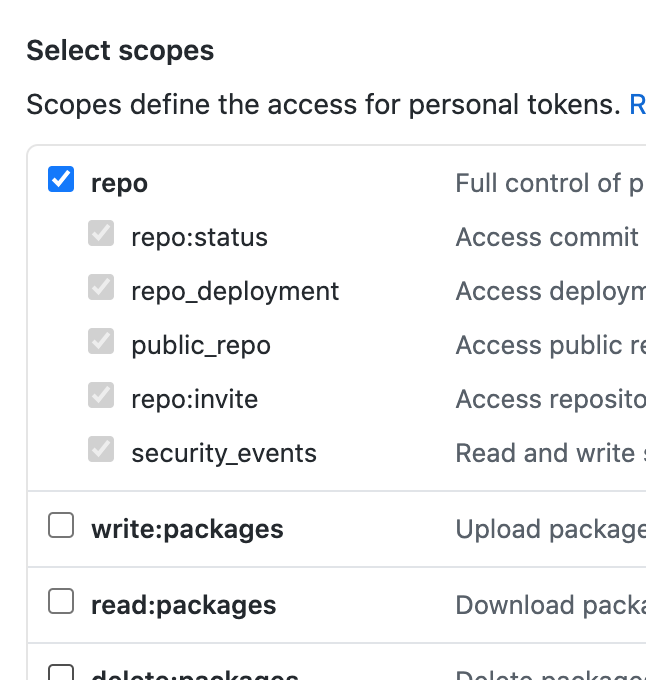

# Creating an App Token

An app token is required for accessing GIT repositories for different providers. You can change the credentials used for GIT under the settings page. You can set different GIT credentials for each GIT provider (i.e. Github, Gitlab, Bitbucket, Other)

Note that an app token password is not required for some providers and you may use your username and password to login directly. Additionally, if you have enabled 2-factor Authentication, you MUST use an app token and not your password. Spck Editor does not collect any login or credential information, but to improve your privacy and for your peace of mind, it is recommended to use an app password so your actual password is not exposed.

The process of creating an app token is different for each provider.

 * [Create a Github app token](#github)

---

# Github

To create an app token for Github, go to this link [https://github.com/settings/tokens](https://github.com/settings/tokens). You need to be logged in to see this page.

1. Click on "Generate new token" to start.

2. You may be required to enter your password.

3. Type a name for the token.

4. Select scopes. It is recommended to select all permissions for "repo". No other permissions is necessary to read and write to repos.

5. Click "Generate Token".

6. Copy and paste this token into Spck Editor credentials modal.

7. Make sure the provider is correctly set or the credentials will not be used correctly. (Github)

---

## Note 2-Factor Authenciation

If you have enabled 2-factor Auth, then you MUST use an app token. Pushing to repositories with basic password is not allowed if 2-Factor Auth is enabled.

