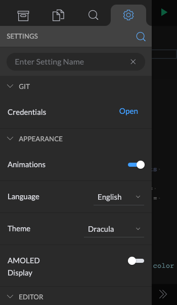
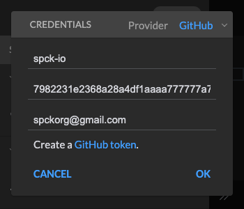
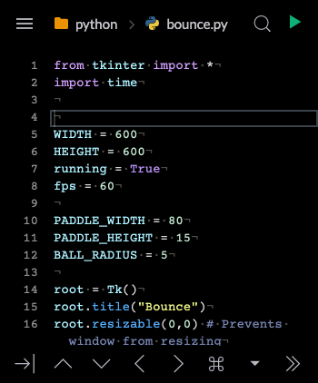
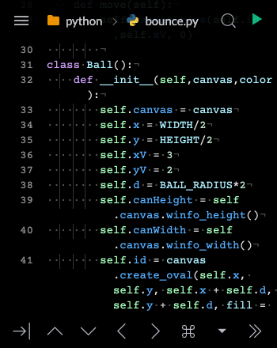
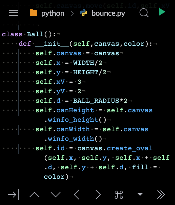
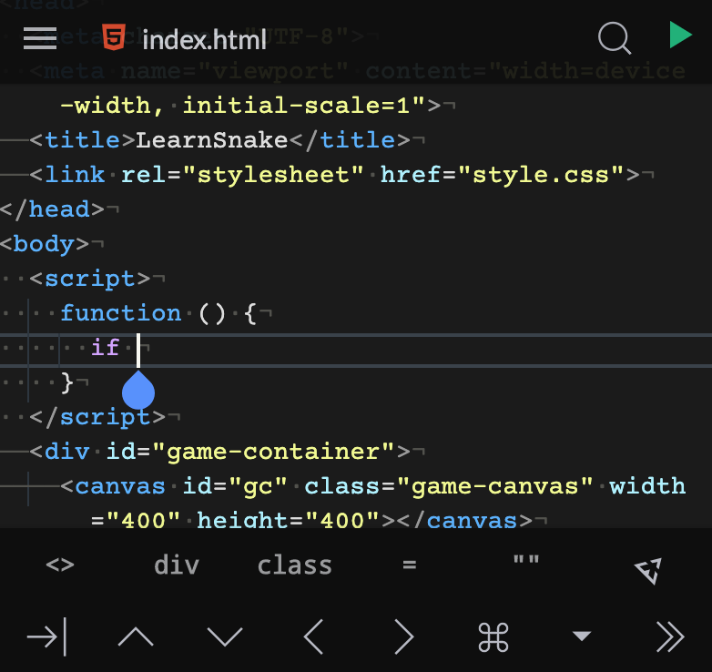
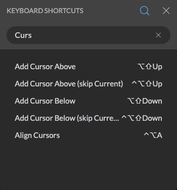

# Editor Settings

The editor settings tab can be used to change various settings of Spck Editor.

- [Searching Settings](#searching-settings)
- [GIT](#git)
- [Appearance](#appearance)
    * [Animation](#animation)
    * [Language](#language)
    * [Theme](#theme)
    * [AMOLED Display](#amoled-display)
- [Editor](#editor)
    * [Autocomplete/Check Syntax](#autocomplete/check-syntax)
    * [Cursor Style](#cursor-style)
    * [Font Size](#font-size)
    * [Font](#font)
    * [Indent Guide](#indent-guide)
    * [Line Numbers](#line-numbers)
    * [Show Invisibles](#show-invisibles)
    * [Indent Guide](#indent-guide)
    * [Use Soft Tabs](#use-soft-tabs)
    * [Word Wrap](#word-wrap)
- [Preview](#preview)
    * [Live Preview](#live-preview)
- [Touch](#touch)
    * [Tablet Mode](#tablet-mode)
    * [Haptic Keypress](#haptic-keypress)
    * [Keyboard Position](#keyboard-position)
    * [Extra Keyboard](#extra-keyboard)
    * [Touch Keyboard](#touch-keyboard)
- [About](#about)
    * [Build](#build)
    * [Keyboard Shortcuts](#keyboard-shortcuts)
    * [Log History](#log-history)
---

## Searching Settings

To search for a setting by name, click on the 🔍 Search Icon and type in the setting name.

The following section lists out specific settings and their intended behavior.

[Back to Top](#editor-settings)

---

## GIT

* __Credentials__: Opens up the GIT Credential modal to change credentials used for different GIT providers (i.e. Github, Gitlab, Bitbucket, Other)

This is an example of using a Github app token to connect to your Github repositories. Cloning or pulling public repositories will not require an app token.

If an invalid app token is set, you will receive "Invalid credentials" error message or "Authentication Error" regardless if the repository is public or private. Make sure you grant the token proper access writes, and allow additional settings to push to the Github/Gitlab/Bitbucket branch. (For example, the master branch may be locked and prevent pushing which will also result in an error.) To properly create an access token, please see [Creating an Access Token for Spck Editor.](./create-app-token/)

[Back to Top](#editor-settings)

---

## APPEARANCE

#### Animation
    Disables all animations in the editor. For example, opening the menu, or modal animations. This is for phones or devices that experience lag with CSS animations and offers a better experience for older devices.

<video width="300" autoplay loop muted playsinline src="./img/editor-settings/animation.mp4"></video>

[Back to Top](#editor-settings)

#### Language
    Use this to change the editor language to a different supported language.

- Currently supported languages include:

    * English (Recommended)
    * Spanish
    * French
    * Portuguese
    * Russian
    * Indonesian
    * Japanese
    * Chinese

[Back to Top](#editor-settings)

#### Theme
    Changes the colors of the code editor. Dark and light editor theme are tied with this setting.

- Light Themes:
    * Ayu Light
    * Chrome
    * XCode
- Dark themes:
    * Ayu Mirage
    * Dracula
    * Monokai
    * One Dark

[Back to Top](#editor-settings)

#### AMOLED Display
    Use this setting for AMOLED screens to save battery life. Changes all editor blacks to use `#000`. This does not affect menus as a degree of contrast is needed for menus and dialogs/modals and they are not expected to be on screen for a long time.

[Back to Top](#editor-settings)

---

## EDITOR

#### Autocomplete/Check Syntax
    Enables advance autocomplete and syntax checking when available for supported languages. Disabling this can help improve performance as autocompletion feature is memory heavy and may have bad performance on older devices. If you are experiencing frequent crashes, it may be due to a memory issue with your phone and it is recommended to try disabling this setting to improve memory usage.

- Advance Autocompletion Support:
    * JavaScript
    * TypeScript
    * HTML
    * CSS
    * SCSS
    * LESS
    
- Basic Autocompletion:
    * Python
    * Java
    * C
    * Ruby
    * Perl
    * Scala
    * More...

[Back to Top](#editor-settings)

#### Cursor Style
    Change the cursor style of the editor. Can choose from "No Blink" or "Slim" cursor.

[Back to Top](#editor-settings)

#### Font Size
    Changes the font size of the code editor.

[Back to Top](#editor-settings)

#### Font
    Changes the font used in the editor. Fonts are downloaded on-demand and can be deleted if they are no longer required.

[Back to Top](#editor-settings)

#### Indent Guide
    Changes the visual setting of showing indent guidelines in the editor.

[Back to Top](#editor-settings)

#### Line Numbers
    Toggles the line numbers in the code editor. Disable line numbers to create more horizontal editing space for the editor.

[Back to Top](#editor-settings)

#### Show Invisibles
    Show invisible characters such as new lines, return carriage, spaces, and tabs. Used to visually differentiate spaces from tabs.

[Back to Top](#editor-settings)

#### Use Soft Tabs
    Toggles whether to use "Soft" Tabs versus real tabs. Soft tabs are spaces instead of real tab character. Turn this off to switch to using real tabs `\t`.

[Back to Top](#editor-settings)

#### Word Wrap
    Toggles soft line wraps in the code editor.

*Note: These settings affect both the main editor as well as the diff editor.*

[Back to Top](#editor-settings)

---

## PREVIEW

### Live Preview
    Turn on and off live previewing in Tablet mode. Live preview will update the side-by-side preview window whenever there is a code change. Updating of the preview will only happen if the preview window is open and has no performance implications when the preview window is not visible. This feature is not useful for phones.

[Back to Top](#editor-settings)

---

### TOUCH

#### Tablet Mode
    Toggles on and off Tablet mode which offers a side by side view of the editor and preview window. This mode is only useful for devices with large screen widths and cannot be turned on for devices with a smaller screen width.

[Back to Top](#editor-settings)

#### Haptic Keypress
    Toggles on and off haptic feedback for the extra keyboard. Haptic feedback is only useful for devices which support this feature.

[Back to Top](#editor-settings)

#### Keyboard Position
    Changes the position of the extra keyboard from Bottom to Top. This feature is useful for iOS devices where the keyboard will hide a portion of the editor including the Extra Keyboard when the virtual keyboard is active.

[Back to Top](#editor-settings)

#### Extra Keyboard
    Toggles on and off the extra Keyboard. The extra keyboard provides shortcuts to code depending on the current editor language or context of the language. For example, the extra keyboard is able to provide JavaScript code suggestions in the context of a `script` tag in an HTML file.

[Back to Top](#editor-settings)

#### Touch Keyboard
    Toggles the Touch keyboard which contain arrow keys and other useful features.

*Note: These settings are only available on devices with a touch screen.*

[Back to Top](#editor-settings)

---

## ABOUT

A section of the settings containing miscellaneous information about the editor. Contains the version information, and a link to report [issues](https://github.com/spckio/spck-issues) with the editor.

There is also an option to revoke privacy permissions granted to the app.

__Warning__: Revoking privacy information means removing all projects, files, and other user data that the app stores.

#### Build
    The build version information of the editor.

[Back to Top](#editor-settings)

#### Keyboard Shortcuts
    Opens up a catalogue of keyboard shortcuts available in the editor.

[Back to Top](#editor-settings)

#### Log History
    Opens up a catalogue of editor actions that are logged. For help in debugging bug reports.

[Back to Top](#editor-settings)

