# Getting Started

Getting started with a new editor can be a challenging experience for a beginner, but even more so for a well-experienced coder. It was certainly a challenging experience for me to learn IDEs like Eclipse and XCode. That being said, thats where this guide comes in. Here, you will learn the basics of creating a new project, adding files to your project, and previewing your project in the browser.

As a side note, if you are using the editor on a mobile device it is encouraged to try the mobile app for the editor:

### Table of Contents

  * [Creating Your First Project](#creating-your-first-project)
    * [Create a New Project](#create-a-new-project)
    * [Import a Github Repo](#import-a-github-repo)
  * [Adding Files](#adding-files)
    * [Basics](#basics)
    * [Folders](#folders)
    * [Upload Files](#upload-files)
  * [Previewing](#previewing)

---

## Creating Your First Project

There are two ways to create projects:
  * Create a new seed project with templates
  * Import a project from an existing Github repo

### Create a New Project

To create a new project from templates, go to the "Projects" tab in the side menu. Open the add dropdown, and select the "__New Project__" option below.

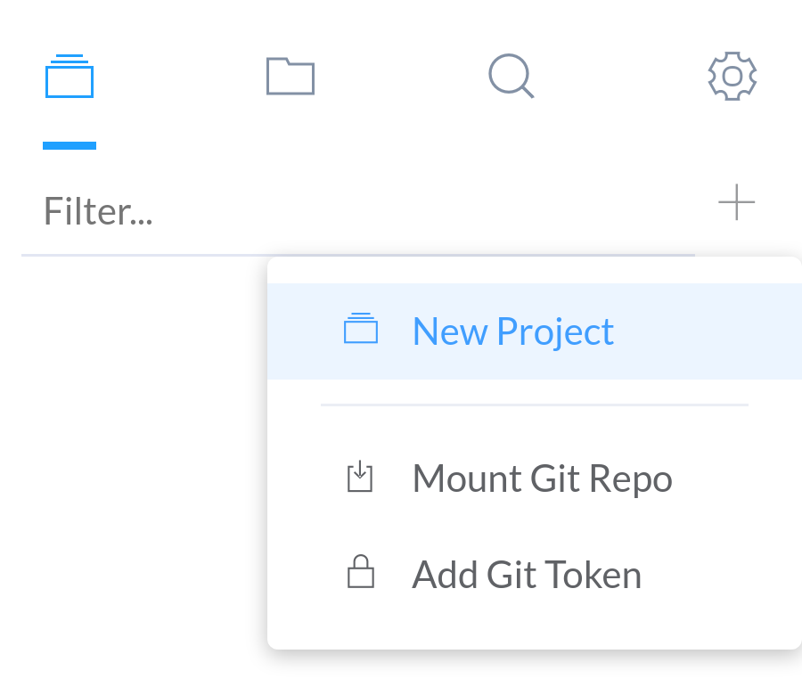

This will open up the project creation prompt. Here, you can choose from a list of JavaScript & CSS framework options. To create an empty project, select "No Framework" to proceed.

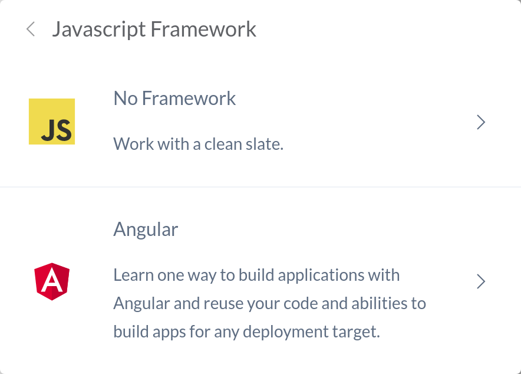

List of frameworks currently available:

  * JavaScript
    * Angular
    * AngularJS
    * React
    * D3
    * Vue
  
  * CSS
    * Bootstrap
    * Material Design Lite
    * UIkit

Enter your project name and click "__Create__".

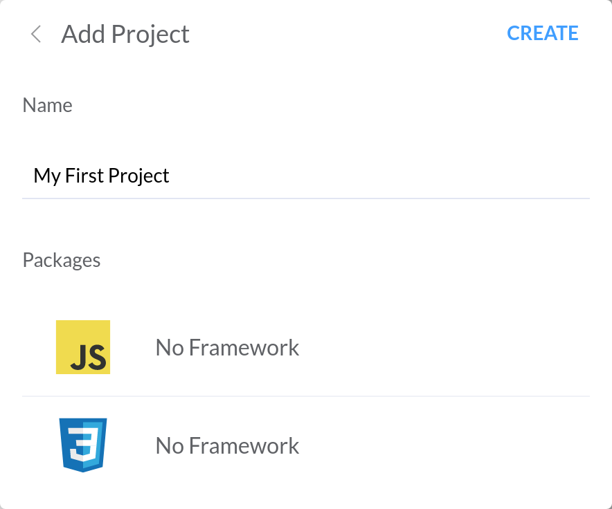

Your new project should be created in the "Projects" tab.

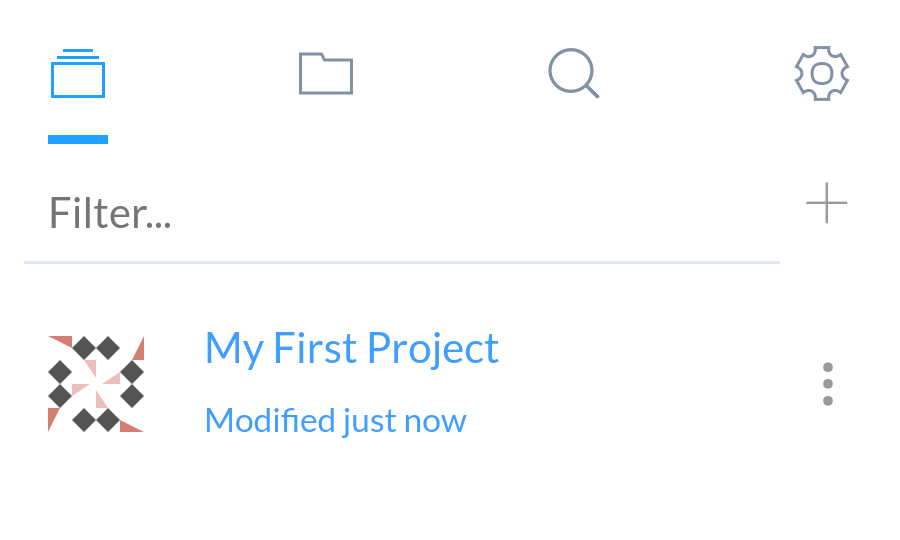

### Import a Github Repo

To import a repository from Github into the editor, first select the "__Mount Git Repo__" option from the "Projects" tab menu.

You will be presented with a prompt to enter the url of the repository to import.

*__If you are importing a large project with more than ~20 or so files, please add a Github token. Github API limits will prevent the project from being imported! To add a Github token please see the section [Adding a Personal Github Token](/git-features.html#adding-a-personal-github-token).__*

In the example, we are using the Spoon Knife repository (https://github.com/octocat/Spoon-Knife).

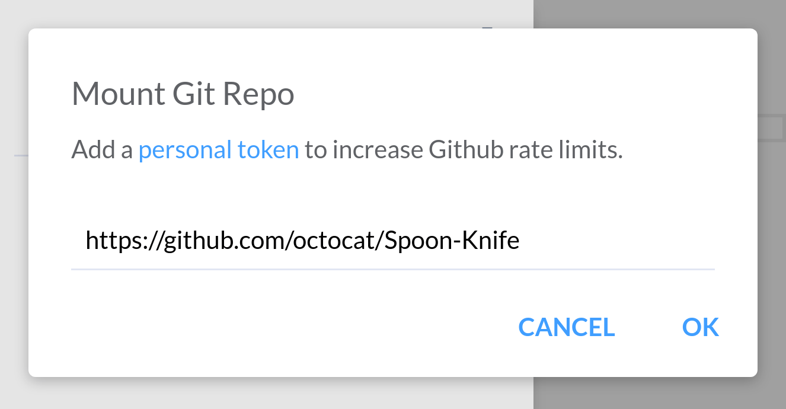

Click "__OK__" to proceed to fetch the latest copy of the branch from Github. Note this will not clone the entire repository. Instead only the latest commit tree of the branch will be downloaded to the editor.

*__If you get an error, it probably means you have exceeded your Github API limit usage. You can add your personal Github token following the instructions [here](/git-features.html#adding-a-personal-github-token).__*

Your cloned Github Repo should appear in the "Projects" tab.

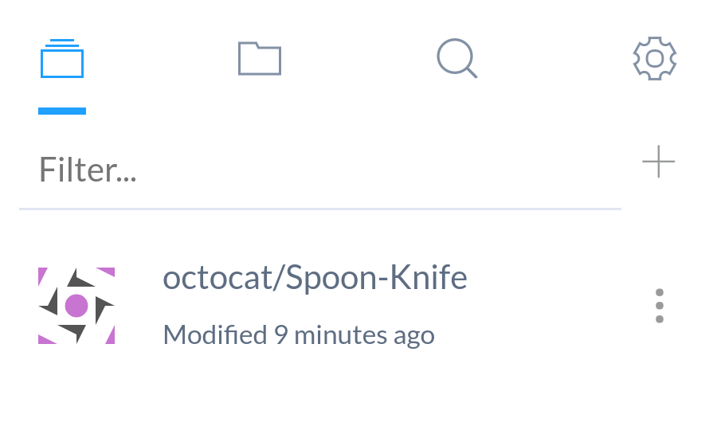

You can switch branches as well. To see details on how to do that, please refer to the section [Changing Git Branches](/git-features.html#changing-git-branches).

---

## Adding Files

### Basics

To add a file in your newly created project, select the "__File__" option in the "Files" tab.

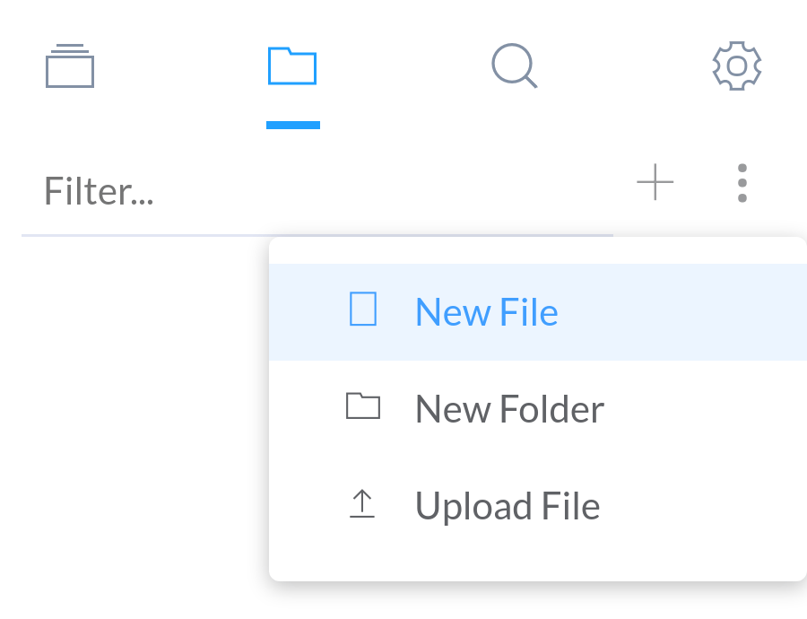

Enter a file name or file path into the prompt and press "__OK__".

*__File paths use '/' as the path separator.__*

*__If the file path's directory does not exist, then the directory will be created automatically.__*

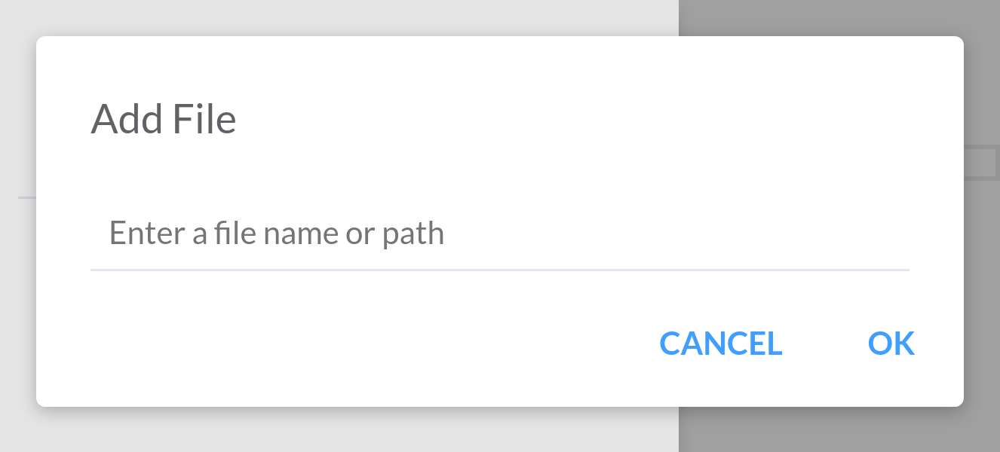

Your file should be created in the "Files" tab. Note that you can use spaces or almost any other characters in the file path.

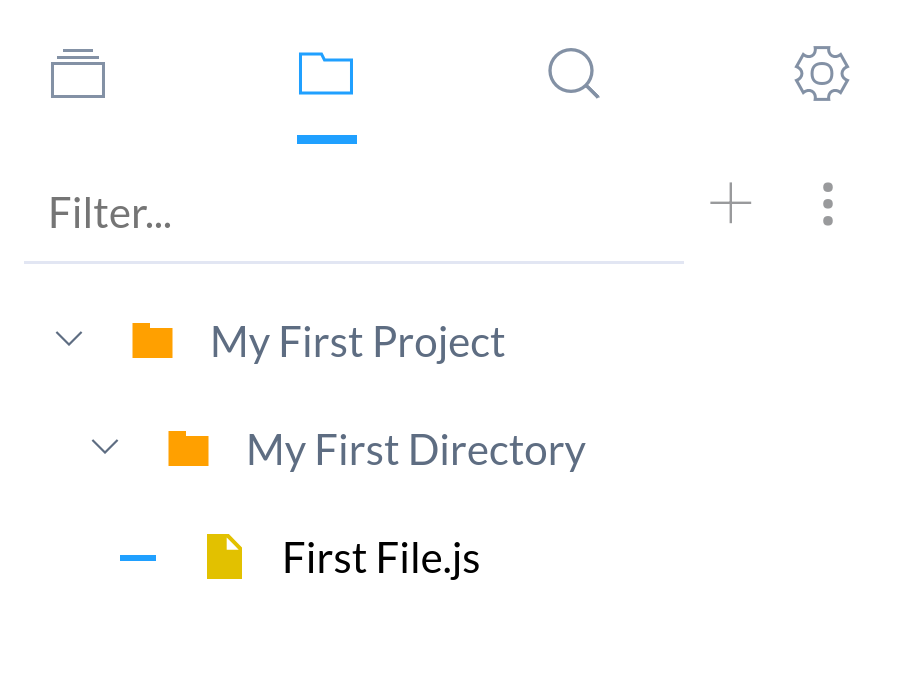

### Folders

By default, using the add menu will put files and folders in the project root directory.

Alternatively, you can right click the folder you want to create resources under. This will open up the following menu:

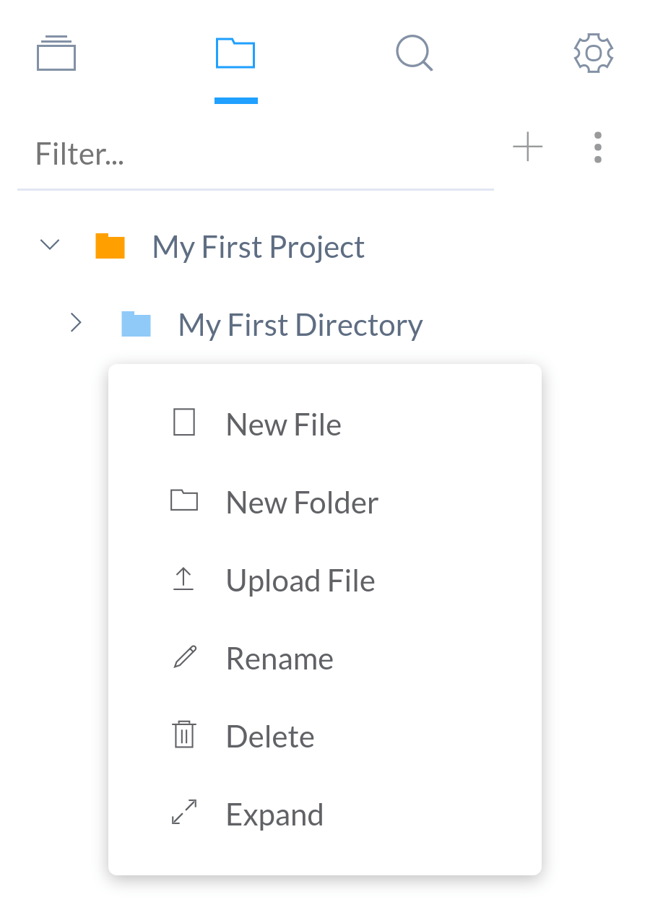

On mobile, the menu will open by clicking on the more options icon.

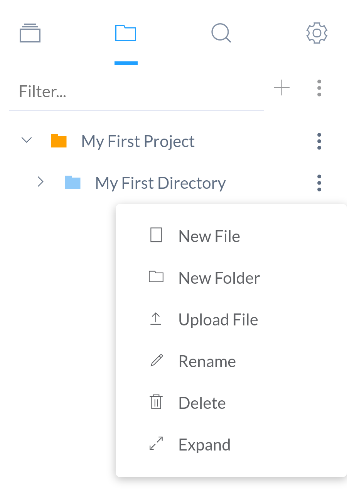

### Upload Files

You can choose files from your computer to be uploaded. Select "Upload File" and choose one or more files to be uploaded to the folder.

---

## Previewing

There are two options for previewing:
  
  * You can launch a new browser showing the __index.html__ page of the project. (This window is separate from the editor and does not respond to live preview.)

  * You can launch a side preview frame on larger screens, which works with live preview. You can also change which HTML file to preview from the top bar.

Pressing the "Play" button will launch a side window, while the "Launch button" will open a new browser.

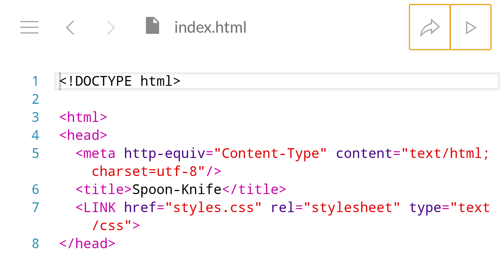

*__On the mobile version, only the launch option is available. The launch feature is more streamlined for mobile and carries additional features like integrated JavaScript console, etc.__*

### Setting Default Launch File

The default file to preview upon clicking "Launch" can be changed. To change the default file, right-click any HTML file and select the "__Launch Default__" option.

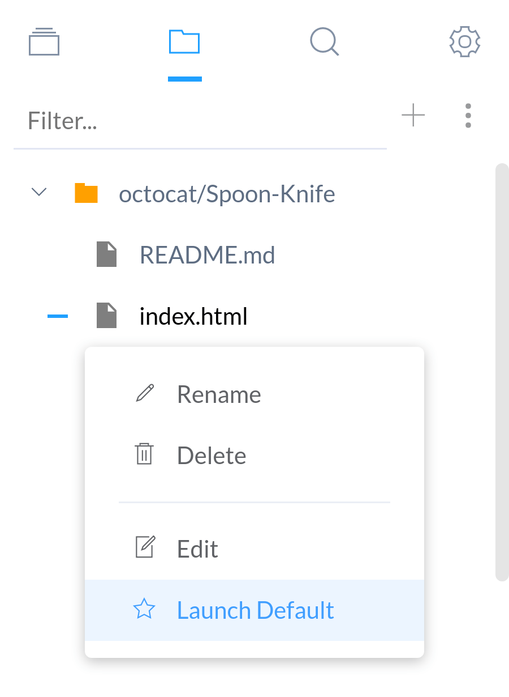

A blue file icon next to any HTML file indicates the current project's default file.

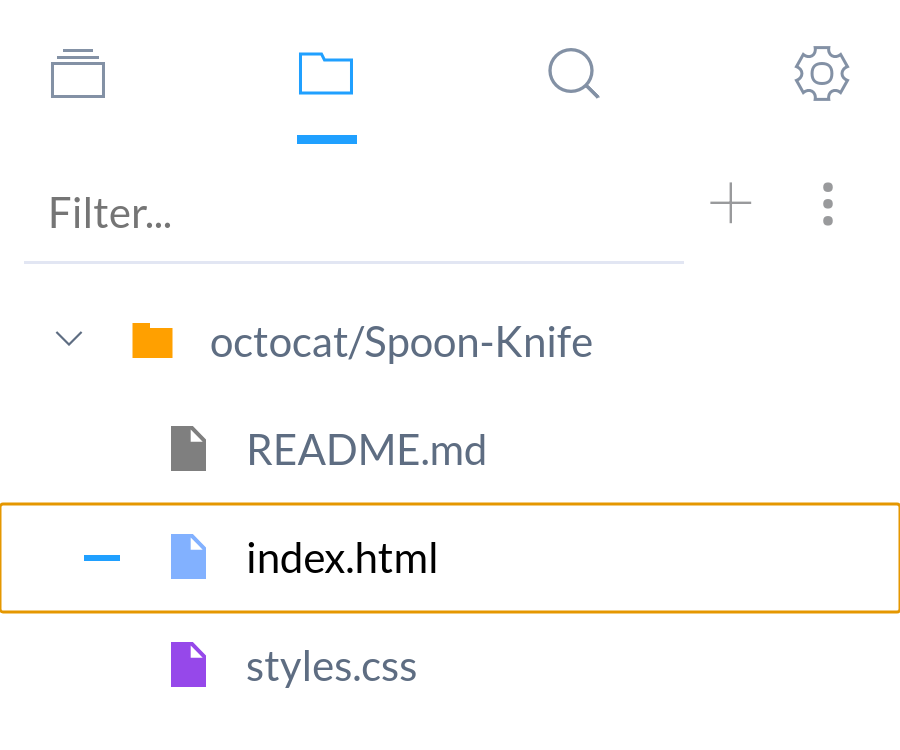

