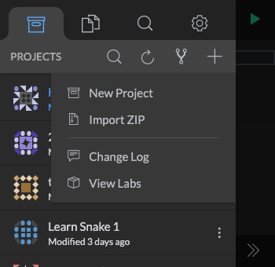
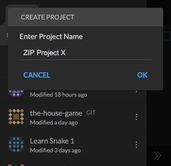
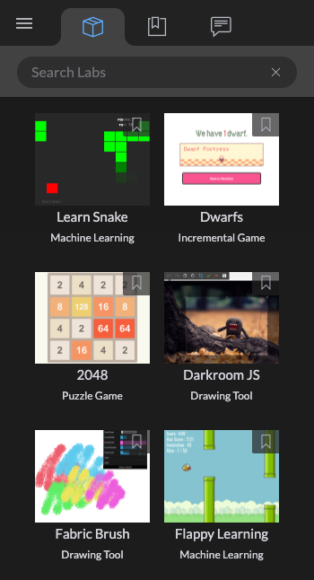
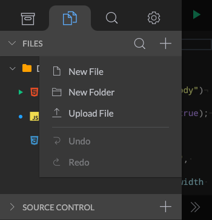
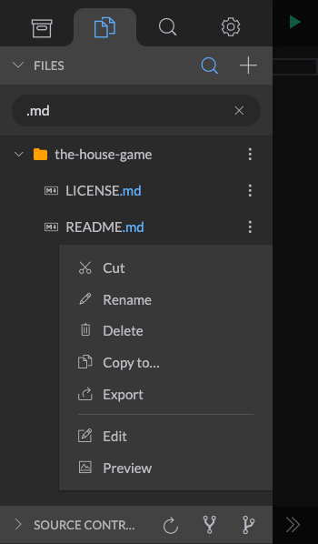
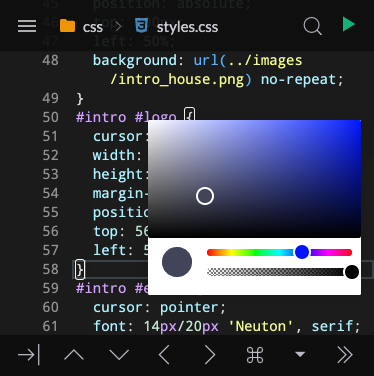
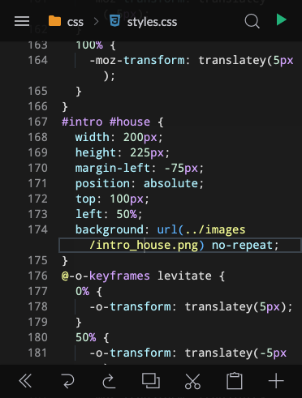
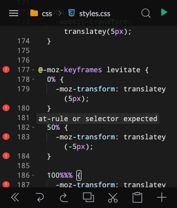

# Getting Started

### The Basics

* [Creating Your First Project](#creating-your-first-project)
    * [Create a new Project from Templates](#create-new-project)
    * [Cloning a Git Repo](#cloning-a-git-repo)
    * [Import a ZIP file](#import-a-zip-file)
    * [Creating a Lab from Templates](#creating-a-lab)
* [Adding Files](#adding-files)
    * [File](#file)
    * [Folder](#folder)
    * [Upload Files](#upload-files)
* [Previewing](#previewing)
    * [Preview Markdown](#preview-markdown)
    * [Preview HTML](#preview-html)
    * [Preview HTML in Tablet Mode](#preview-html-in-tablet-mode)
    * [Resize Preview Window](#resize-preview-window)
    * [Setting Default File](#setting-default-launch-file)

### Advanced Topics

* [Files](#files)
    * [Cut/Paste Files](#cut/paste-files)
    * [Moving File](#moving-file)
    * [Duplicate File](#duplicate-file)
* [Editing](#editing)
    * [Arrow Keys](#arrow-keys)
    * [Extra Keyboard](#extra-keyboard)
    * [Emmet Key](#emmet-key)
    * [Copy/Paste](#copy/paste)
    * [Go to Next Error](#go-to-next-error)
    * [Autoformat/Reformat Code](#autoformat/reformat-code)
    * [Viewing Syntax Errors](#viewing-syntax-errors)
* [Diff Editing](#diff-editing)
    * [Toggle Code Folding](#toggle-code-folding)
    * [Reverting Edits](#reverting-edits)

### Mobile App Links

---

## Creating Your First Project

There are a few ways to create a new project in Spck Editor. These include:

  * [Create a new Project from Templates](#create-new-project)
  * [Cloning a Git Repo](#cloning-a-git-repo)
  * [Import a ZIP file](#import-a-zip-file)
  * [Creating a Lab from Templates](#create-a-lab)

### Create New Project

To create a new project from a list of predefined templates, go to the **Projects** tab menu, click the + Icon and select __New Project__.

<video width="300" autoplay loop muted playsinline src="./img/getting-started/create-new-project.mp4"></video>

List of frameworks currently available:

  * JavaScript
    * Angular
    * AngularJS
    * React
    * D3
    * Vue
  
  * CSS
    * Bootstrap
    * Bulma
    * Material Design Lite
    * Semantic UI
    * UIkit

[Back to Top](#getting-started)

### Cloning a Git Repo

From the Projects tab menu, click on the GIT icon and select **Clone Repo**. This will bring up the GIT clone modal. Enter in a GIT repo HTTPS URL and click OK to begin cloning. For more information on GIT cloning, please visit the [GIT Guide](git-guide.html#cloning-a-repo)

<video width="300" autoplay loop muted playsinline src="./img/git-features/cloning.mp4"></video>

[Back to Top](#getting-started)

### Import a ZIP file

Simple ZIP files can be imported into Spck Editor. ZIP Archives offer a way to archive and export/import projects that does not rely on GIT. Archives offer a simple way to share small projects. To import a ZIP archive, follow the steps below:

1. Open the Projects menu tab, click on the + icon and select **Import ZIP**.

2. This should open up a system dialog to select a ZIP file depending on what system you are using. Select a ZIP file to import. Note: ZIP files do not store file encodings in the archive, it is assume that the file encoding is UTF-8, which might not be the case if the ZIP file was generated on an older Windows computer or using external tools. There is no way for the editor to detect what encoding the ZIP file is using, so other encodings may result in data corruption or an import error.

3. The import process should begin, and a new project name prompt will show before the project is imported. Enter a project name for the ZIP file.

[Back to Top](#getting-started)

### Creating a Lab

Labs offer a neat way to learn from other projects created by other devs and programmers. There are labs using D3, Three.js that range from simple games to machine learning demos. To create a lab, follow the steps below.

1. Open the Projects menu tab, click the + icon, and select **View Labs**. This will bring you to the Labs gallery page where you can choose from all of the labs available.

2. Click on any lab to create a project that duplicates the code as a local project.

[Back to Top](#getting-started)

---

## Adding Files

### File

To create a new file you need to have created and open a project first. To add a file to the project, follow the steps below.

1. Open the File tab menu, click the + icon and select **New File**.

    

2. Enter a file name or file path into the prompt and press "__OK__". *File paths use '/' as the path separator.*
    
    

[Back to Top](#getting-started)

### Folder

To create a new folder you need to have created a and opened a project first. To add a folder to the project, follow the steps below.

1. Open the File tab menu, click the + icon and select **New Folder**.

    
    
    b. Alternatively, you can right click the folder you want to create folder under. This will open up the following menu:
    
     

2. Enter a folder name or folder path into the prompt and press "__OK__". *If the folder path's directory does not exist, then the directory will be created automatically.*

    

[Back to Top](#getting-started)

### Upload Files

You can choose existing files on your device to upload to your project. To upload a file you need to have created a and opened a project first.

1. Open the File tab menu, click the + icon and select **Upload File**.

    
    
    b. Alternatively, you can right click the folder you want to upload under. This will open up the following menu:
    
     

2. Select the file that you want to upload. After selecting, the file should appear under the folder you selected or under the project root folder.

[Back to Top](#getting-started)

---

## Previewing

The editor allows for previewing of HTML pages and Markdown files. Additional file types and languages are planned to be supported in the future.

### Preview Markdown

Previewing markdown `.md` files can be done following the steps below.

1. Click on the Menu icon next to the file and select **Preview** option.

    

    Preview of the Markdown file, shown in the editor view.

    

[Back to Top](#getting-started)

### Preview HTML

Previewing HTML `.html` is the default when you click the Play ▷ button. By default, the project will preview the current HTML file (one being edited) before looking for any `index.html` in the project root. The priority of the HTML file to preview is as follows:

1. Current Editing HTML File
2. Default HTML File (See [Setting Default Launch File](#setting-default-launch-file))
3. Any `.html` in the project root
4. Any `.html` in subdirectories

To preview HTML files on mobile, click the Play ▷ button in the main view:

### Preview HTML in Tablet Mode

In Tablet Mode (only for Tablets or wide-screen devices), a second preview option is available. This option does not launch a separate window for the preview, but instead offer a side-by-side preview next to the editor. Follow the steps below to launch side-by-side Preview.

1. Turn on **Tablet Mode** (if available) in the Settings menu tab. See [Tablet Mode](editor-settings.html#tablet-mode) for more details.

2. There should now be a Side Preview icon next to the default Play icon. Click on the new icon to launch Side Preview.

    

3. The preview should open to the right. The size of the preview window can be adjusted by dragging the resize bar between the editor and the preview area.

    

### Resize Preview Window

The size of the Preview window can be adjusted when in Tablet mode and using the side preview window. To adjust the preview window size, use the bar between the Editor and the Preview window.

<video width="442" autoplay loop muted playsinline src="./img/getting-started/resize-preview.mp4"></video>

[Back to Top](#getting-started)

### Setting Default Launch File

The default HTML file to preview upon clicking the Play  ▷ button can be changed. To change the default file to preview, right-click any HTML file and select the __Launch Default__ option.

The default launch file will be marked by a green Play icon. The default launch file will not have priority above any currently editing HTML file. Please see [Preview HTML](#preview-html) for the priority of preview files.

[Back to Top](#getting-started)

---

## Files

These are more advanced features that will be covered for Spck Editor. For the basics, please visit the section above on Creating a Project, Adding Files, and Previewing.

### Cut/Paste Files

If you need to move files between folders within a project, then use the Cut & Paste feature. To Cut & Paste a file or folder, follow the steps below.

<video width="300" autoplay loop muted playsinline src="./img/getting-started/cut-paste.mp4"></video>

[Back to Top](#getting-started)

### Moving File

To move files or folders within a project, you can use the [Cut/Paste](#cut/paste-files) method described above. To move files outside of the project to another project, you can use the "**Copy to...**" feature and then deleting of the file after successfully copying.

<video width="300" autoplay loop muted playsinline src="./img/getting-started/copy-to.mp4"></video>

### Duplicate File

You can also duplicate files using the technique described above in [Moving File](#moving-file). Simply use the **Copy to** feature on the same project to create a duplicate of the file or folder.

[Back to Top](#getting-started)

## Editing

There are various editing features that are not covered in this section that can be found in the [Editor Settings](editor-settings.html) page. For example, switching to using real Tab characters or showing invisibles can be managed through the Editor settings.

This section covers some basics as well as some useful, but perhaps hard to find features of the editor such as Code Formatting, and jumping to the Next Error.

### Arrow Keys

The arrow keys offer the useful way to navigate code. The arrow keys are part of the Touch keyboard that is available on mobile devices. On iOS the Touch keyboard placement is at the top of the screen to prevent being covered by the software keyboard.

<video width="300" autoplay loop muted playsinline src="./img/getting-started/arrow-keys.mp4"></video>

The arrow keys also provide useful navigation function when using autocomplete. Simply use the the Up and Down arrows to change Autocomplete selection and use the Tab key to complete it.

<video width="300" autoplay loop muted playsinline src="./img/getting-started/arrow-key-autocomplete.mp4"></video>

[Back to Top](#getting-started)

### Extra Keyboard

The extra keyboard provides additional keys that may not be readily available on your mobile keyboard. This helps reduce the about of keyboard switching needed to code. There are different key configurations for HTML, CSS, JS and the keys shown will depend upon the file extension as well as the context. Below is an example showing how the extra keyboard switches between HTML, JS, CSS mode depending on the HTML tag.

<video width="300" autoplay loop muted playsinline src="./img/getting-started/extra-keyboard-context.mp4"></video>

The extra keyboard also provides a color selector when in CSS mode as well as an Emmet key when in HTML or in CSS modes. See [Emmet Key](#emmet-key) for more details on Emmet.

[Back to Top](#getting-started)

### Emmet Key

Emmet is a shorthand syntax to reduce typing when editing HTML or CSS files. Emmet tries to emulate CSS selector syntax, a brief guide on Emmet can be found here
[https://docs.emmet.io/cheat-sheet/](https://docs.emmet.io/cheat-sheet/).

<video width="300" autoplay loop muted playsinline src="./img/getting-started/emmet.mp4"></video>

[Back to Top](#getting-started)

### Copy/Paste

Copy and Pasting can be done in 2 ways. One way is to use the Touch Keyboard extra section. Click on the >> Key on the Touch Keyboard to access additional keys for Copy & Paste.

To select text, use a long press to begin selection. You can use the cursor keys provided with the selection to adjust the selection. An action bar will appear with keys to Cut and Paste.

<video width="300" autoplay loop muted playsinline src="./img/getting-started/copy-paste.mp4"></video>

[Back to Top](#getting-started)

### Go to Next Error

From the extra section of the Touch keyboard (To access click on the >> Key) there is the useful feature to jump to the next syntax error in the file. To use this feature follow the steps below.

1. From the Touch Keyboard, click the + key to expand additional features.

2. Click **Next Error** to jump to the next syntax error that the editor finds.

    <video width="300" autoplay loop muted playsinline src="./img/getting-started/next-error.mp4"></video>

[Back to Top](#getting-started)

### Autoformat/Reformat Code

The extra menu in the Touch keyboard also provides the option to reformat the code using jsbeautify. This reformatting works for all HTML, CSS, JS files. See the example below on using this feature.

<video width="300" autoplay loop muted playsinline src="./img/getting-started/autoformat.mp4"></video>

[Back to Top](#getting-started)

### Viewing Syntax Errors

Within the line number gutter, there will be icons to show syntax errors, warnings, or bad practices. To access the information reported by the syntax validation feature, click on the icon to see the message. Please note that both the **Autocomplete/Check Syntax** and **Line Number** settings must be enabled to use this feature. See [Editor Settings](editor-settings.html) for more details.

[Back to Top](#getting-started)

---

## Diff Editing

The diff editor is only available to projects using a GIT backed repository. For information on how to create a GIT repository, please visit the [GIT Guide](git-guide.html) page.

<video width="300" autoplay loop muted playsinline src="./img/git-features/open-diff.mp4"></video>

[Back to Top](#getting-started)

### Toggle Code Folding

When using the diff editor, parts of the code that are not changed will not be highlighted. For long sections of the code that are not changed and are not important for the purpose of comparing changes, they are hidden (folded) by default. To see the lines of code hidden, click on the "Toggle Fold" text above certain lines to expand and collapse the hidden code.

<video width="300" autoplay loop muted playsinline src="./img/getting-started/diff-code-fold.mp4"></video>

[Back to Top](#getting-started)

### Reverting Edits

The diff editor can also be used to revert individual edits (line-by-line reverting). This is a useful feature to get rid of edits that caused some sort of error, or to undo any mistakes in the editing. To use this feature, click on the "Revert" text above changed lines to revert it back to the original.

You can use the Undo/Redo buttons located at the bottom of the diff editor to undo/redo any reverts done on the file.

<video width="300" autoplay loop muted playsinline src="./img/getting-started/reverting-edit.mp4"></video>

[Back to Top](#getting-started)

