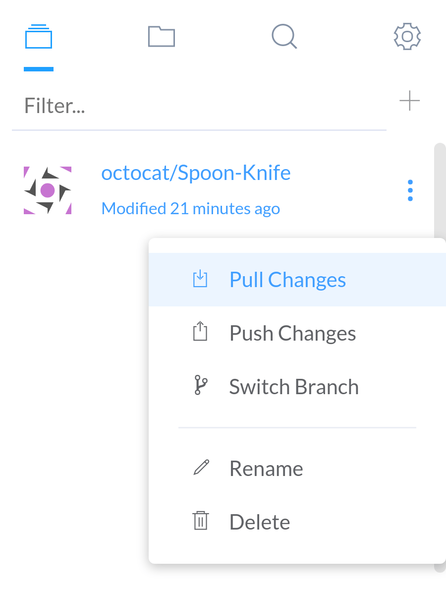
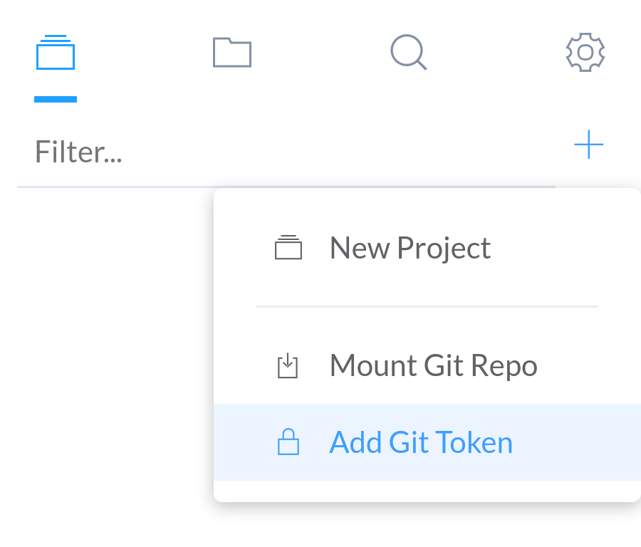
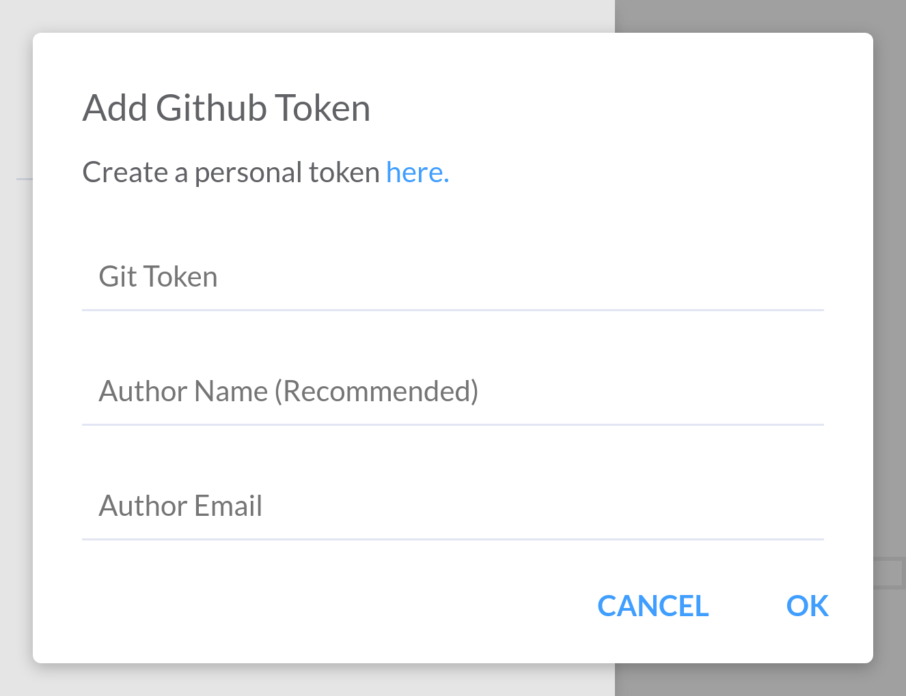
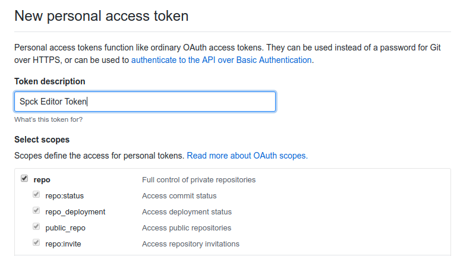
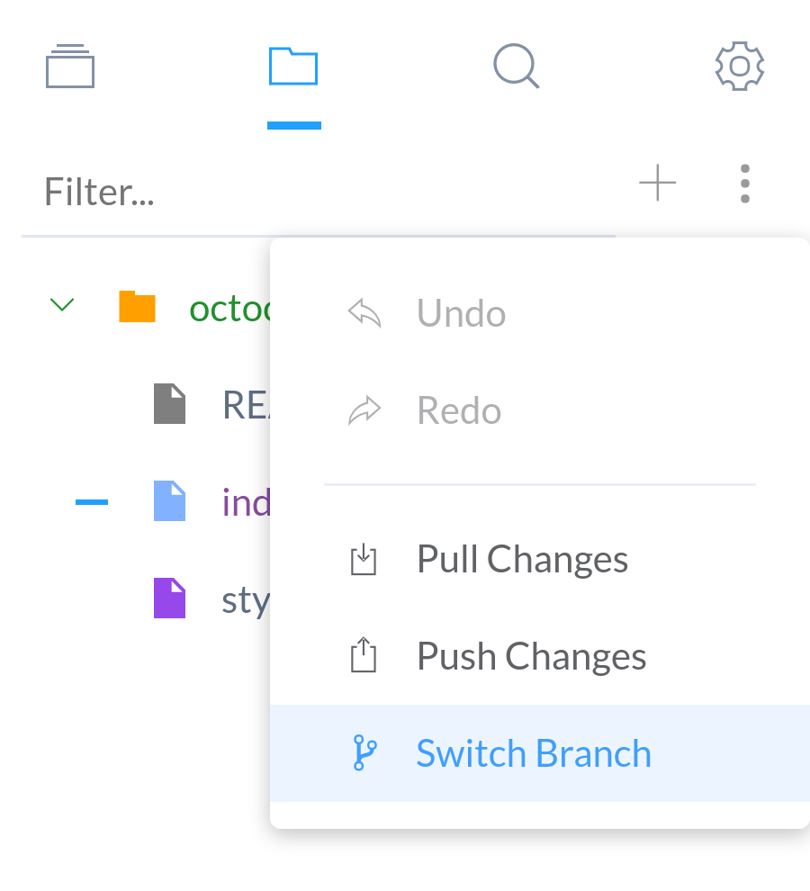
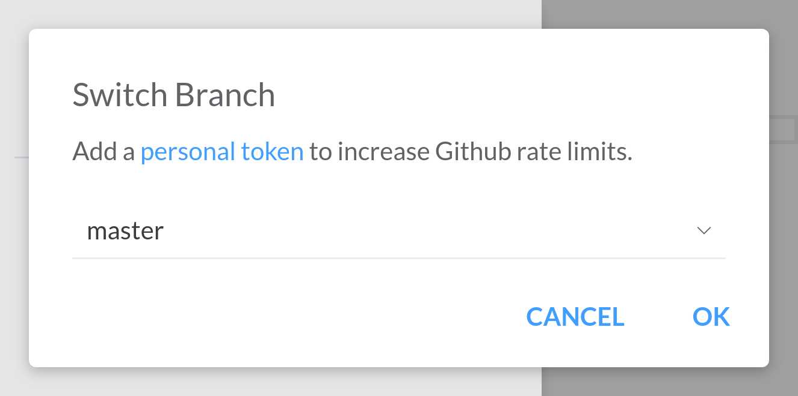
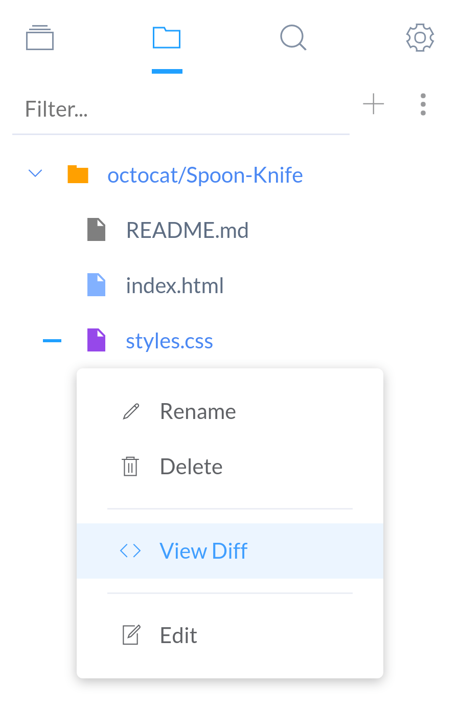
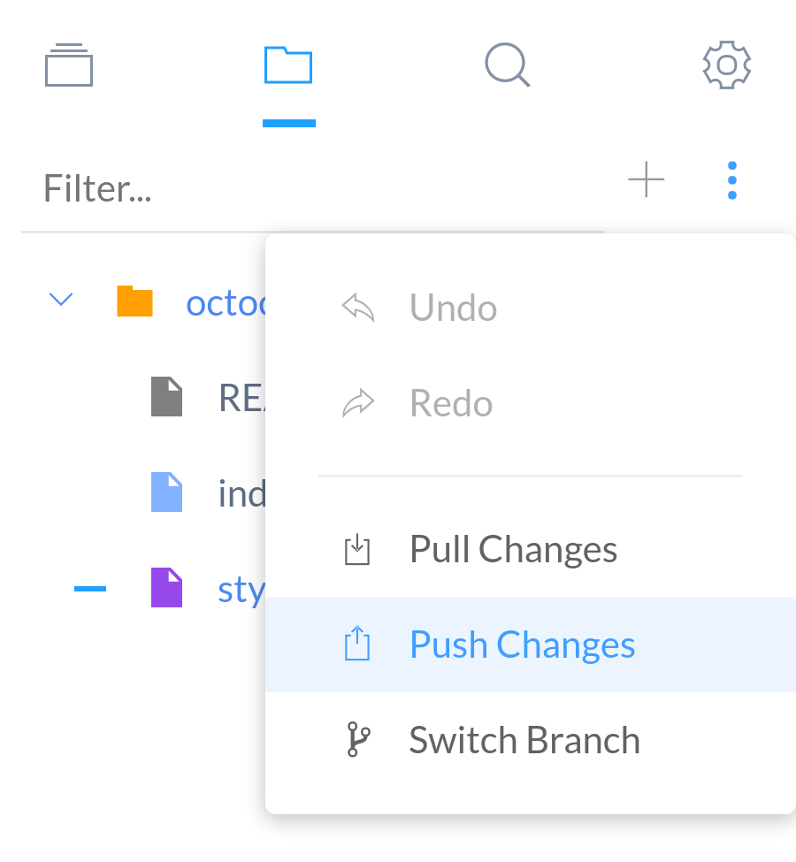

# Git Features

Github currently is the only way of exporting projects from the editor. Although other ways of exporting such as to shared drives is planned for the future.

Right now Github is the only supported git repository provider by this editor. This document tries to summarize the git integration that is already available int he editor.

### Table of Contents

* [Getting Started](#getting-started)
  * [Mounting a Github Repo](#mounting-a-github-repo)
  * [Pulling Remote Changes](#pulling-remote-changes)
  * [Merge Conflicts](#merge-conflicts)
  * [Adding a Personal Github Token](#adding-a-personal-github-token)

* [Branching](#branching)
  * [Creating Branches](#creating-branches)
  * [Changing Git Branches](#changing-git-branches)

* [File Diffs](#file-diffs)
  * [Viewing Diffs](#viewing-diffs)

* [Commiting](#committing)

---

## Getting Started

### Mounting a Github Repo

The process of mounting a Github repo has already been covered in the section [Import a Github Repo](/getting-started.html#import-a-github-repo). It will not be covered here; note that it is recommended to [add a Github personal token](#github-token) to allow for mounting of bigger repositories as well as to increase your daily usage limits of Github's APIs.

### Pulling Remote Changes

Pulling will download any changes on the remote Github server that the editor is missing. Essentially, this is the process lets the editor's repository catch up on changes made by others to the remote repository.

To pull changes from the remote repository, open the project's options menu and select the "__Pull Changes__" option.

*__If there is a discrepency between a file's last known state between the remote repo and the editor, then the file is marked as having a merge conflict. This is covered in more detail in the section [Merge Conflicts](#merge-conflicts).__*

### Merge Conflicts

Sometimes a file have a discrepancy with the remote repository, and the history cannot differentiate which one is newer. As a result, the file is marked as having a "Merge Conflict". These files will be marked in purple.

Projects with merge conflicts cannot push commits to the remote repository until all merge conflicts are resolved.

Currently the only way to resolve merge conflicts is to manually mark them as resolved by right-clicking on the file and selecting the "__Mark Resolved__" option.

### Adding a Personal Github Token

Adding a personal Github Token to the app will increase the rate limit usage of Github APIs to 5000 requests per hour. This is more than enough to download most repositories. It is recommended to use a Github personal token (which requires a Github account) if you are mounting repositories with more than ~20 or so files.

To add a Github token, choose the "__Add Git Token__" option from the menu in the "Projects" tab.

In the prompt that appears you need to enter the Github personal token that you generated, as well as author username and email for commits. If you leave this blank, then the editor defaults will be used instead for the email and username.

To Generate the Github token on the website, click the "__here__" link provided in the "Add Github Token" prompt.

Next click "__Generate new token__" button on Github's page.

Enter the token name and select all "__repo__" permissions.

## Branching

### Creating Branches

Currently, creating branches is not possible in the editor. Branches would have be to created on Github until this feature is implemented.

### Changing Git Branches

To change the current branch, go to the "Files" tab menu and select the "__Switch Branch__" option. Alternatively, switching branches can also be done form the "Projects" tab.

This will open up the "Switch Branch" prompt. The project's current branch will be the current selected option. Choose an available branch from the selection menu and click "__OK__" to proceed.

*__If there are uncommited changes in the branch before switching, they will be stored locally. Next time you switch back to the original branch, the changes will be brought back.__*

---

## File Diffs

Sometimes you need to see changes between your local repository and the remote repository; this is when a diff viewer is needed. Spck Editor has a built-in diff viewer for files that have changed from the remote repo.

### Viewing Diffs

To view changes that have occurred, select a file marked in yellow or blue depending on if the editor is in "dark" or "light" mode.

This should open up a modal with a unified view of the diffs. Currently, the editor does not offer any editing features in the diff viewer.

---

## Committing

To make a Github commit, select the "__Push Changes__" option from the menu in the "Files" tab.

*__Pushing changes require a Github token. To add a Github token please see the section on [Adding a Personal Github Token](#adding-a-personal-github-token).__*

*__If you receive a 401 or 403 error, it means that the token you have provided does not have the permissions necessary to commit to the current repository.__*

